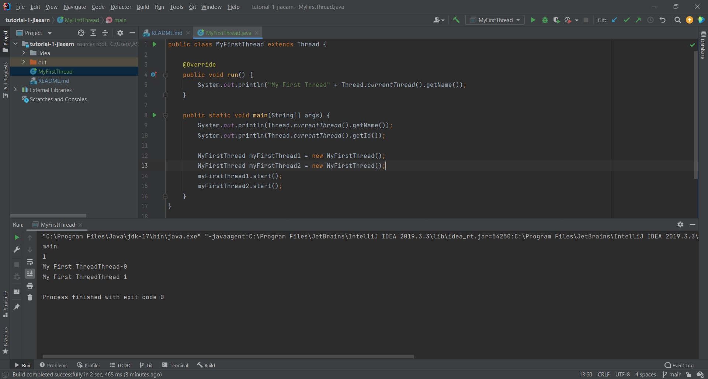

## Your Info:
1. Matric Number: 269509
2. Name: Tan Jia Earn

## Instruction:

1. Watch the video below:

    https://youtu.be/FtjwRAYj9C4

2. Rewrite the Java program and upload the program to this repo.
3. The program file should be named as `MyFirstThread.java`
4. Screenshot the result and upload to this repo too.

## Output/Result

 

